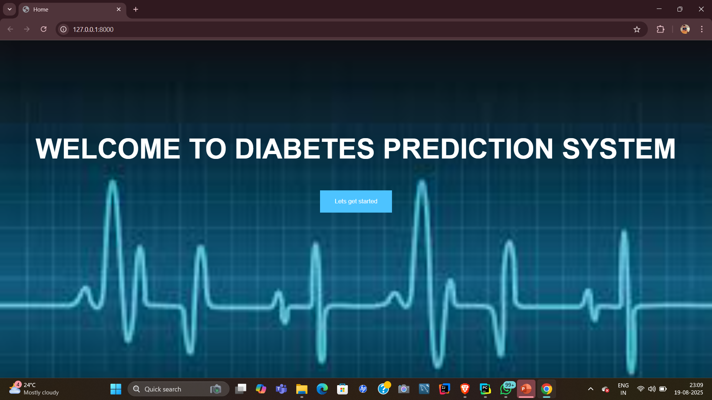
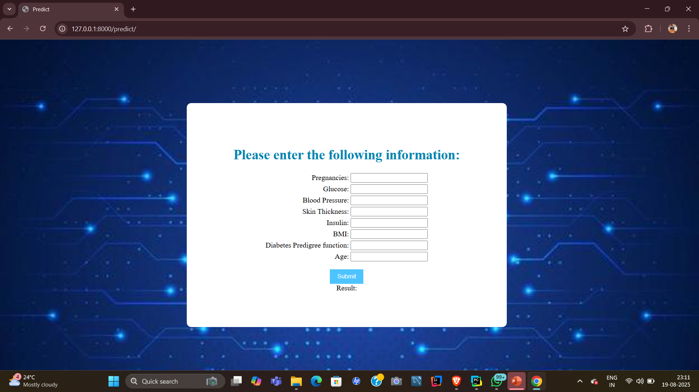
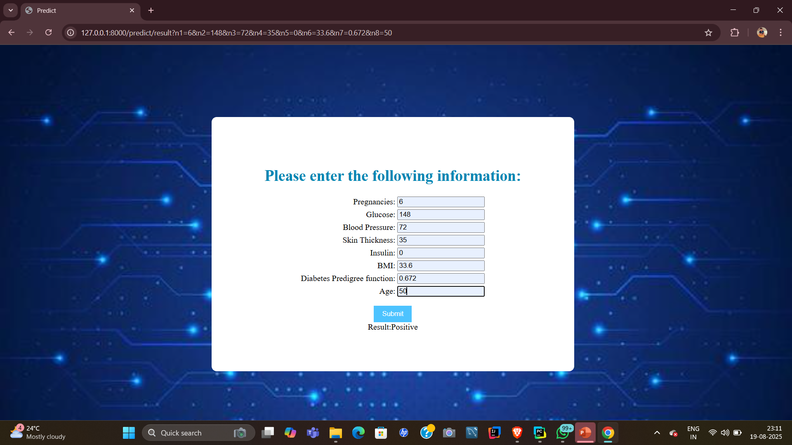
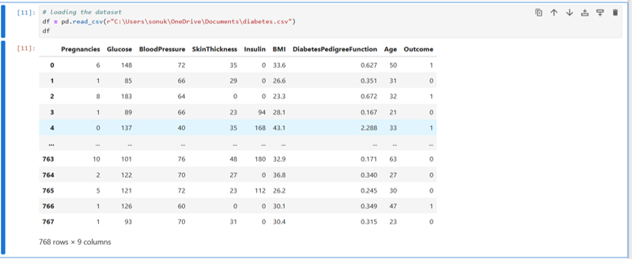
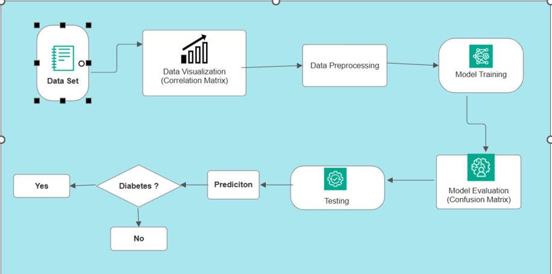

# 🩺 Diabetes Prediction System



The Diabetes Prediction System is a web-based application that leverages Machine Learning to predict the likelihood of diabetes based on basic medical details such as glucose level, blood pressure, insulin level, BMI, and age. It is developed using Python (Scikit-learn, Pandas, NumPy) for ML, and Django for the web interface.

## Table of Contents

- [Introduction](#introduction)
- [System Architecture](#system-architecture)
  - [Front-end](#front-end)
  - [Back-end](#back-end)
  - [Dataset](#dataset)
  - [Architecture Diagram](#architecture-diagram)
- [Machine Learning Models](#machine-learning-models)
- [Installation](#installation)
- [Usage](#usage)
- [Future Scope](#future-scope)
- [References](#references)

---

## Introduction

Diabetes is one of the most chronic and life-threatening diseases worldwide. Early diagnosis is crucial to prevent serious complications like heart disease, kidney failure, and nerve damage. This project provides an accessible tool for early diabetes prediction, particularly for individuals who cannot afford frequent checkups.

---

## System Architecture

The system consists of three main components: the front-end, back-end, and database.

### Front-end

The front-end is built using **HTML, CSS, and Bootstrap**, offering a simple interface where users can enter their medical details and receive predictions.

**Front End Pages:**

- **Homepage:**

  Overview of the application and instructions for prediction.
  
  
- **Prediction Page:**

  Input form for medical parameters and button to predict.
  
  
- **Results Page:**

  Displays prediction results (Diabetic/Non-Diabetic).
  
  

---

### Back-end

The back-end is developed using **Django**, handling data processing, ML model prediction, and communication with the front-end.

**Back-end Features:**

- Accepts user input from the front-end.  
- Loads trained ML models for prediction.  
- Returns instant prediction results.  
- Handles user session management and server requests.

---

### Dataset



---

### Architecture Diagram

Below is a high-level diagram that illustrates the architecture of the Diabetes Prediction System:



---

## Machine Learning Models

We trained multiple ML models using an 80/20 train-test split:

| Model                     | Accuracy  |
|----------------------------|-----------|
| Decision Tree             | 75.32%    |
| Random Forest             | 79.86%    |
| Support Vector Machine(SVM)| 76.22%   |

✅ **Random Forest** was the most accurate model with **79.86% accuracy**.

---

## Installation

1. Clone the repository:
    ```bash
    git clone https://github.com/your-username/diabetes-prediction-system.git
    cd diabetes-prediction-system
    ```

2. Create a virtual environment & install dependencies:
    ```bash
    python -m venv venv
    source venv/bin/activate   # Windows: venv\Scripts\activate
    pip install -r requirements.txt
    ```

3. Run migrations & start the Django server:
    ```bash
    python manage.py migrate
    python manage.py runserver
    ```

4. Open in browser:
    ```
    http://127.0.0.1:8000/
    ```

---

## Usage

1. Go to the **Prediction Page**.  
2. Enter medical details (Glucose, Blood Pressure, BMI, Insulin, Age).  
3. Click **Predict**.  
4. The system will display whether the user is **Diabetic** or **Non-Diabetic**.

---

## Future Scope

- 📲 Mobile App Development (Android/iOS)  
- ⌚ Integration with Wearables for real-time prediction  
- 🤖 Advanced Deep Learning models for improved accuracy  
- 👤 User Accounts & History Tracking

---

## References

- UCI Machine Learning Repository – Pima Indians Dataset  
- Scikit-learn Documentation  
- Django Documentation  
- Bootstrap Official Site  
- Research papers on diabetes prediction using ML

